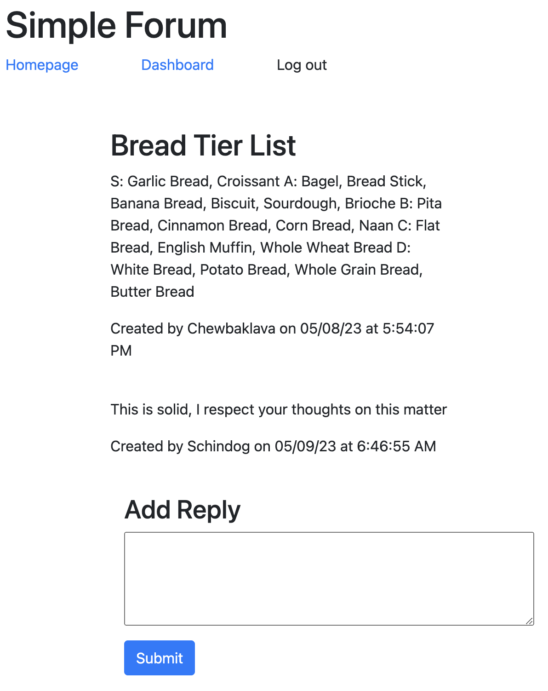

# Simple Forum

[Use the app here!](https://eschindev-simple-forum.herokuapp.com/)

## Table of Contents

- [Description](#description)
- [Installation](#installation)
- [Technologies](#technologies)
- [Questions](#questions)

## Description

A simple forum that allows users to create accounts; create, edit, and delete posts; and leave replies to posts.

## Installation

It is deployed, so no installation necessary to use as-is, but to run it locally, clone the repo, cd into it, run npm i, use mysql to create the database using schema.sql, seed the database with npm run seed, and then use npm start to initialize the app.

## Technologies

- Node.js
- Sequelize
- Express.js
- Heroku
- JAWSDB
- Handlebars

## Questions

[My GitHub Profile](https://github.com/eschindev)

[Email me!](mailto:eschindler1993@gmail.com)
